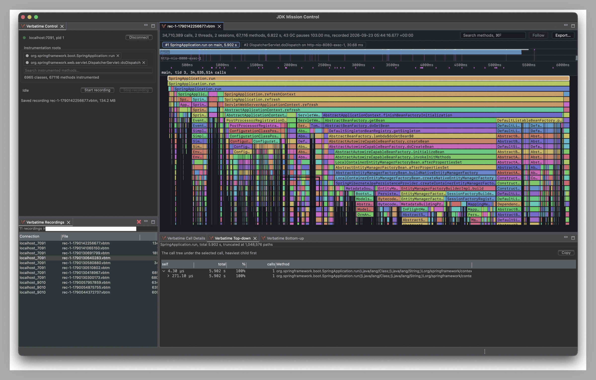

# Verbatime

<p align="center">
  
</p>

Records every Java method call under the methods you choose, and shows where the time went.

## Why

To see where one request, one server startup, or one batch job spent its time, you need every
call it made, in order. A sampling profiler only sees some of them, and most other profilers merge
all requests into one average.

Verbatime is a tool for development. It records everything and shows it as it happened.

- **Every call.** Each run of a method you choose becomes one call tree, with the order and time
  of every call in it. Nothing is sampled or dropped.
- **Drop in.** Add one `-javaagent` flag. No code changes.
- **Cheap.** A recorded call costs about 35 ns.
- **Large recordings.** 100 million calls open smoothly.



## Quick start

You need Java 25 or later for the application, and
[JDK Mission Control](https://github.com/openjdk/jmc) to view
the results.

1. Download `verbatime-agent.jar` and `verbatime-jmc-plugin.jar` from the
   [GitHub releases page](https://github.com/yagipass/verbatime/releases). To check that they
   were built by this repository's GitHub Actions, verify them with the
   [GitHub CLI](https://cli.github.com/).
   ```sh
   gh attestation verify verbatime-agent.jar --repo yagipass/verbatime
   gh attestation verify verbatime-jmc-plugin.jar --repo yagipass/verbatime
   ```
2. Copy the plugin into the `dropins` directory of JDK Mission Control, and restart it.
   ```sh
   # macOS
   cp verbatime-jmc-plugin.jar "/Applications/JDK Mission Control.app/Contents/Eclipse/dropins/"
   # Linux and Windows
   cp verbatime-jmc-plugin.jar <jmc>/dropins/
   ```
3. Start your application with the agent and a JMX port.
   ```sh
   java -javaagent:/path/to/verbatime-agent.jar \
        -Dcom.sun.management.jmxremote.port=7091 -Dcom.sun.management.jmxremote.rmi.port=7091 \
        -Dcom.sun.management.jmxremote.host=127.0.0.1 \
        -Dcom.sun.management.jmxremote.authenticate=false -Dcom.sun.management.jmxremote.ssl=false \
        -Djava.rmi.server.hostname=localhost \
        -cp ... your.Main
   ```
   These flags turn off JMX authentication.
4. In JDK Mission Control, choose `Window > Verbatime`. In the Verbatime Control view, connect
   to `localhost:7091`.
5. Under Instrumentation roots, add the methods to measure.
6. Press Start recording, use the application, then press Stop recording.

The recording opens as a timeline flame chart. Click a call to see its details, the calls under
it, and who called it.

To try it without your own application, [`examples/`](examples/) has ready-to-run setups for
Spring Boot, Tomcat, Quarkus, a batch job, JUnit runs, and more.

## More ways to use it

### Recording a test run or a batch job

When the JVM finishes before you can press Start recording, let the agent alone record from startup
to exit and write the result to a file. No JMX port is needed.

```text
-javaagent:/path/to/verbatime-agent.jar=record=startup,roots=com.example.app.Job::run,out=trace.vbtm
```

The [agent README](modules/agent/README.md#options) lists every option.

### Reading a recording from the command line or with an AI agent

`vbtm` prints the slowest sessions, the hottest methods, and the call tree, a little at a time.

```sh
vbtm sessions trace.vbtm --sort dur
vbtm tree trace.vbtm 7
```

[`skills/vbtm/`](skills/vbtm/SKILL.md) is an agent skill that uses `vbtm` to find out why a
request was slow. See the [CLI README](modules/cli/README.md).

## Documentation

| Where | What |
|---|---|
| [verbatime-docs.yagipass.com](https://verbatime-docs.yagipass.com) | The documentation site: quick start, use cases, and troubleshooting |
| [`modules/agent/`](modules/agent/) | The Java agent and its options |
| [`modules/jmc/`](modules/jmc/) | The JDK Mission Control plugin and its views |
| [`modules/cli/`](modules/cli/) | The `vbtm` command |
| [`modules/format/`](modules/format/) | Reading and writing `.vbtm` files from Java |
| [`examples/`](examples/) | Example applications to try |

## Build

```sh
nix develop .#agent --command mvn -B -pl modules/agent -am verify
nix develop .#jmc   --command mvn -B -pl modules/jmc   -am verify
nix develop .#cli   --command mvn -B -pl modules/cli   -am verify
```

```sh
nix develop .#docs --command sh -c 'cd docs && npm ci && npm run build'
```

## License

Verbatime is licensed under the [Apache License, Version 2.0](LICENSE).
Copyright 2026 yagipass. See [NOTICE](NOTICE) for attribution requirements when redistributing.
