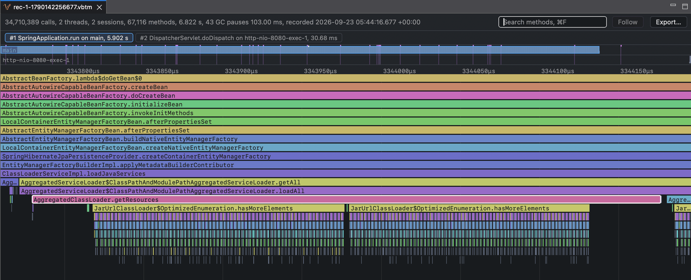
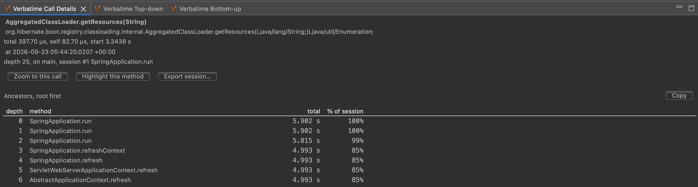

# Verbatime JMC plugin

A JDK Mission Control plugin that starts and stops recordings, and shows `.vbtm` recordings as a
timeline flame chart.

## Why

A recording holds every call a request, a startup, or a batch job made. To find where the time
went, you need to see those calls in order and move between the whole run and a single call.

- **Timeline flame chart.** Each session is drawn in time order, so you see what ran when and for
  how long.
- **Call views.** Click a call to see its details, the call tree under it, or who called each
  method in it.
- **Recording from JDK Mission Control.** Connect to a running application, choose the methods to
  measure, and press Start recording and Stop recording.
- **Large recordings.** A recording is read in parts as you look at it, so JDK Mission Control does
  not need more memory for a larger recording.



## Usage

### Installation

Download `verbatime-jmc-plugin.jar` from the
[GitHub releases page](https://github.com/yagipass/verbatime/releases), copy it into the `dropins`
directory of JDK Mission Control, and restart it. The directory is next to the `jmc` launcher.

```sh
cp verbatime-jmc-plugin.jar <jmc>/dropins/
```

On macOS, the directory is inside the application bundle.

```sh
cp verbatime-jmc-plugin.jar "/Applications/JDK Mission Control.app/Contents/Eclipse/dropins/"
```

To uninstall, delete the file and restart. If a new jar does not take effect, start JDK Mission
Control once with `-clean`.

### Recording

Start the application with the agent and a JMX port, as shown in the
[agent README](../agent/README.md#recording-from-jdk-mission-control). Then, in the Verbatime
Control view. To show the Verbatime views, choose `Window > Verbatime`.

1. Enter `localhost:7091` and press Connect.
2. Under Instrumentation roots, add the methods to measure.
3. Press Start recording, exercise the application, then press Stop recording.

The recording is saved on your machine, listed in the Verbatime Recordings view, and opened.

### Viewing

Open a recording from the Verbatime Recordings view, or choose `File > Open` and pick a `.vbtm`
file. Select a session to show its flame chart, then click a call.

When a recording opens, JDK Mission Control switches to the Verbatime perspective.

| View | Shows |
|---|---|
| Verbatime Call Details | The selected call and its callers, root first. |
| Verbatime Top-down | The call tree under the selected call, heaviest child first. |
| Verbatime Bottom-up | Who called each method under the selected call. |



### Settings

Under `Window > Preferences > Mission Control > Verbatime`, you can change the directory where
recordings are saved.

## Build

From the repository root, as described in [Build](../../README.md#build):

```sh
nix develop .#jmc --command mvn -B -pl modules/jmc -am verify
```

This writes `target/verbatime-jmc-plugin.jar` and runs the unit tests.

To work on the plugin in the Eclipse IDE, use a package that includes PDE, such as Eclipse IDE for
RCP and RAP Developers, and import this directory with
`File > Import > General > Existing Projects into Workspace`.

## License

Verbatime is licensed under the [Apache License, Version 2.0](../../LICENSE).
Copyright 2026 yagipass. See [NOTICE](../../NOTICE) for attribution requirements when redistributing.
